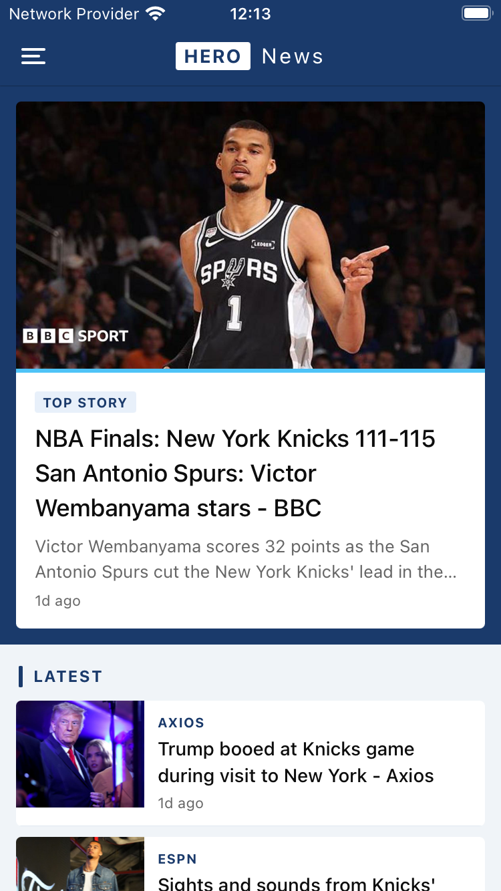

# 📰 NewsApp

A BBC News-inspired mobile news application built with **React Native** and **Expo**. Fetches live articles from NewsAPI across multiple categories with a clean, blue-toned UI.

---

## 📱 Screenshots



---

## ✨ Features

- 🗂️ **7 news categories** — General, Business, Technology, Sports, Entertainment, Science, Health
- 🎨 **BBC News-inspired UI** — Blue-toned design with hero cards and article thumbnails
- 📖 **Article detail screen** — Full article view with share functionality
- 🔄 **Pull to refresh** — Swipe down to fetch latest news
- 🗃️ **Drawer navigation** — Slide-out menu for category switching
- 🌐 **Live data** — Powered by [NewsAPI](https://newsapi.org)

---

## 🛠️ Tech Stack

| Technology | Usage |
|---|---|
| React Native | Mobile framework |
| Expo | Development platform |
| TypeScript | Type safety |
| React Navigation | Drawer + Stack navigation |
| NewsAPI | News data source |

---

## 🚀 Getting Started

### Prerequisites

- Node.js 18+
- Expo CLI
- A free API key from [newsapi.org](https://newsapi.org)

### Installation

```bash
# Clone the repository
git clone https://github.com/yourusername/NewsApp.git
cd NewsApp

# Install dependencies
npm install

# Create environment file
cp .env.example .env
```

### Environment Variables

Create a `.env` file in the project root:

```
EXPO_PUBLIC_NEWS_API_KEY=your_api_key_here
```

> Get a free API key at [newsapi.org](https://newsapi.org/register)

### Run

```bash
expo start --clear
```

---

## 📁 Project Structure

```
NewsApp/
├── App.tsx                  # Root component, navigation container
├── drawer/
│   └── DrawerNavigator.tsx  # Drawer navigator with custom styling
├── screens/
│   ├── CategoryScreen.tsx   # News list screen per category
│   └── ViewNewsSection.tsx  # Article detail screen
├── service/
│   └── newService.ts        # NewsAPI fetch logic
├── .env                     # Environment variables (git ignored)
└── .env.example             # Environment variable template
```

---

## 🔌 API

This app uses the [NewsAPI](https://newsapi.org) `/top-headlines` endpoint.

```
GET https://newsapi.org/v2/top-headlines?category={category}&apiKey={key}
```

> **Note:** The free NewsAPI plan only works on localhost. For production builds, a paid plan or a proxy backend is required.

---

## 📦 Dependencies

```bash
npm install @react-navigation/native @react-navigation/drawer @react-navigation/stack
npm install react-native-gesture-handler react-native-reanimated react-native-screens
npm install react-native-safe-area-context react-native-vector-icons
```

---

## 🗺️ Roadmap

- [ ] In-app browser for full article reading (WebView)
- [ ] Bookmark / save articles
- [ ] Skeleton loading screens
- [ ] Dark mode support
- [ ] Search functionality
- [ ] Push notifications for breaking news

---

## 👤 Author

**Emre EDEMİR**

---

## 📄 License

This project is open source and available under the [MIT License](LICENSE).
